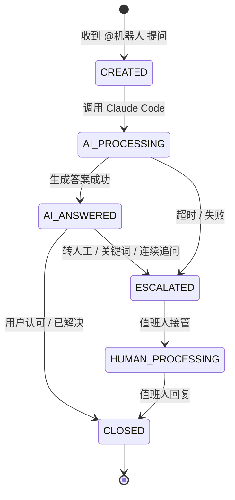
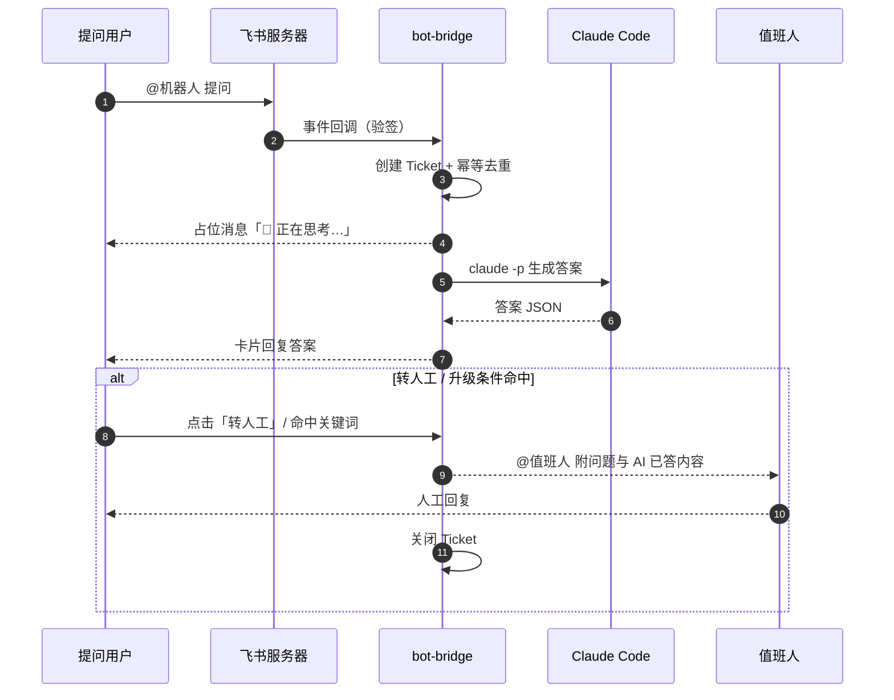

# PRD：飞书 × Claude Code 答疑值班机器人

| 项 | 内容 |
|---|---|
| 文档版本 | v0.1（草案） |
| 状态 | 待评审 |
| 作者 | justn0w |
| 日期 | 2026-09-12 |
| 关联仓库 | justn0w-bot-bridge（Gin + GORM + MySQL） |

---

## 1. 背景与目标

### 1.1 背景

团队内部存在大量重复性的技术/业务答疑需求，人工答疑响应慢、依赖值班人个人经验、难以 7×24 覆盖。同时，Claude Code 具备读代码库、理解项目上下文并给出可执行答案的能力，但缺少一个团队可共同触达的统一入口。

### 1.2 目标

打通「飞书机器人」与「Claude Code」，落地一个**人机协同的答疑值班系统**：

1. **AI 自动兜底**：用户在飞书群里 `@机器人` 提问，Claude Code 自动回答，覆盖通用知识 + 指定代码仓库的代码级答疑。
2. **人机协同升级**：AI 答不上、用户不满意或触发升级条件时，自动转给当前值班人人工处理。
3. **值班可管理**：支持排班、当前值班人查询、交接，保证任何时刻都有明确的责任人。

### 1.3 非目标（Out of Scope）

- 不做通用知识库/向量检索的完整知识中台（本期以 Claude Code 上下文 + FAQ 兜底）。
- 不做多租户/对外 SaaS 化。
- 不做飞书以外的 IM（钉钉/企微）接入。

---

## 2. 术语

| 术语 | 说明 |
|---|---|
| 机器人 | 飞书企业自建应用的机器人能力 |
| 事件订阅 | 飞书服务端向本项目回调消息事件（`im.message.receive_v1`） |
| Ticket（工单/会话） | 一次答疑交互的完整生命周期 |
| 转人工（升级） | 由 AI 处理切换为人工值班处理 |
| Claude Code Headless | `claude -p` 非交互式调用，作为答疑引擎 |

---

## 3. 用户与角色

| 角色 | 说明 | 核心诉求 |
|---|---|---|
| 提问用户 | 在飞书群里 @机器人 提问的人 | 快速得到准确答案 |
| 值班人（Oncall） | 当前被排班、负责兜底答疑的人 | 及时被通知、高效交接 |
| 值班管理员 | 维护排班表、配置规则的人 | 排班灵活、可控 |
| 系统 | bot-bridge 服务 + Claude Code | 稳定、可观测 |

---

## 4. 核心用户故事

- US1：作为提问用户，我在群里 `@机器人` 提问，能在 1 分钟内收到 AI 回答。
- US2：作为提问用户，当我对 AI 回答不满意时，可以一键「转人工」。
- US3：作为值班人，当有 AI 无法回答的问题时，我会被 @ 并看到完整上下文。
- US4：作为值班人，我可以回复答案并关闭工单。
- US5：作为管理员，我可以查看排班、今日值班人、工单统计。

---

## 5. 功能需求

### 5.1 飞书机器人接入

- **FR-1.1** 使用飞书企业自建应用，开启「机器人」能力。
- **FR-1.2** 订阅消息事件 `im.message.receive_v1`，接收群内 `@机器人` 消息。
- **FR-1.3** 回调接口实现飞书 URL 验证（Verification Token / Encrypt Key）与事件签名校验。
- **FR-1.4** 支持通过飞书开放接口回复消息（回复消息卡片 / 文本），支持 `@` 指定用户。

### 5.2 Claude Code 打通

- **FR-2.1** 通过 Claude Code Headless（`claude -p`，JSON 输出）生成答案。
- **FR-2.2** 支持两类答疑：
  - 通用知识答疑：默认工作目录，不依赖仓库。
  - 代码仓库答疑：将 Claude Code 工作目录指向目标仓库，按需 `--add-dir` 注入额外上下文。
- **FR-2.3** 支持配置模型、超时、最大输出 token。
- **FR-2.4** 调用结果结构化返回（答案文本、是否明确「无法回答」、耗时）。

### 5.3 答疑流程（人机协同状态机）

单次答疑（Ticket）状态流转：



- **FR-3.1** 收到 `@机器人` 提问后创建 Ticket，机器人先回「正在思考…」占位。
- **FR-3.2** 调用 Claude Code 生成答案，成功后回复提问人，Ticket 进入 `AI_ANSWERED`。
- **FR-3.3** 用户回复「转人工」/ 点击卡片按钮，或管理员配置的升级关键词命中，触发转人工。
- **FR-3.4** 升级时通知当前值班人（@值班人 + 附上问题全文与 AI 已给答案），Ticket 进入 `HUMAN_PROCESSING`。
- **FR-3.5** 值班人回复后关闭 Ticket；提问人可追加追问延续同一 Ticket。

### 5.4 值班排班

- **FR-4.1** 维护排班表：日期、时段、值班人（飞书 user_id）、负责的群。
- **FR-4.2** 支持手动排班与按人轮值生成。
- **FR-4.3** 查询「当前值班人」，供升级路由使用。
- **FR-4.4** 支持交接：值班人变更后，新值班人可查看到期未关闭的工单。

### 5.5 升级机制

- **FR-5.1** 自动升级条件（满足任一即转人工）：
  - Claude Code 明确回复「无法回答 / 不确定」；
  - 调用超时（默认 90s）或调用失败；
  - 同一 Ticket 内用户连续追问 ≥ 3 次；
  - 命中配置的升级关键词（如「人工」「找个人」）。
- **FR-5.2** 手动升级：卡片按钮「转人工」/ 回复「转人工」。
- **FR-5.3** 升级需附完整上下文（问题、AI 答案、会话历史）。

### 5.6 会话与消息记录

- **FR-6.1** 所有问答、状态变更、升级行为落库，用于统计与审计。
- **FR-6.2** 支持按群、按值班人、按时间段查询工单。

---

## 6. 非功能需求

| 类别 | 需求 |
|---|---|
| 安全 | 飞书回调验签 + 加解密；Claude Code 输出脱敏（仓库内可能含密钥）；工单数据访问控制 |
| 可靠性 | 事件幂等去重（飞书可能重推）；异步处理避免回调超时；Claude Code 调用失败可重试 |
| 性能 | 首响 < 5s（占位消息）；AI 答案 < 90s；单群并发 ≥ 10 提问不阻塞 |
| 可观测 | 结构化日志、调用耗时、工单统计指标、Claude Code 调用失败告警 |
| 可配置 | 升级关键词、超时阈值、模型、工作目录均可配置，无需改代码 |

---

## 7. 系统架构

```mermaid
flowchart LR
    subgraph Feishu[飞书侧]
        U[提问用户] -->|@机器人 提问| FS[飞书服务器]
    end

    FS -->|事件回调 im.message.receive_v1| BB[bot-bridge Go 服务]

    subgraph BB[bot-bridge]
        F[feishu 模块<br/>验签 / 收发消息]
        O[oncall 模块<br/>排班 / 升级 / 会话]
        C[claude 模块<br/>Headless 调用]
        F --> O --> C
    end

    O --> DB[(MySQL<br/>工单 / 排班 / 消息)]
    C -->|claude -p| CC[Claude Code CLI]
    CC -->|工作目录| REPO[(代码仓库)]
```

### 7.1 核心时序（AI 答疑 + 转人工）



**与现有代码一致的扩展方式**（沿用 handler / service / repository / model / dto 分层）：

```
internal/
  feishu/      # 事件回调 handler、消息加解密、发送客户端
  claude/      # Headless 调用封装（命令构造、JSON 解析、超时控制）
  oncall/      # 排班、升级、Ticket 业务逻辑
```

新增路由（与现有 `/api/v1` 并存）：

- `POST /webhook/feishu/event`：飞书事件回调入口。
- `POST /api/v1/oncall/shifts`：排班管理（管理员）。
- `GET  /api/v1/oncall/current`：当前值班人。
- `GET  /api/v1/oncall/tickets`：工单查询。

---

## 8. 数据模型（MySQL）

| 表 | 关键字段 | 说明 |
|---|---|---|
| `oncall_shift` | date, time_slot, user_id, group_id | 排班表 |
| `oncall_ticket` | id, group_id, asker_id, status, source, repo_path, created_at, closed_at | 工单/会话 |
| `oncall_message` | id, ticket_id, role(user/ai/human), content, cost_ms, escalated | 消息与升级记录 |

Ticket `status` 枚举：`created / ai_processing / ai_answered / escalated / human_processing / closed`。

---

## 9. 关键交互设计（飞书）

- **提问**：群里 `@机器人 问题…`，机器人回复占位「🤖 正在思考…」。
- **AI 回答**：以卡片消息返回（答案文本 + 「👍 已解决」「👤 转人工」按钮）。
- **转人工**：点击按钮/回复关键词 → 机器人 `@值班人`：`【转人工】问题：xxx / AI 已答：xxx`。
- **人工闭环**：值班人直接回复，系统关闭工单。

---

## 10. 技术选型与决策

| 决策点 | 选择 | 理由 |
|---|---|---|
| Claude Code 调用方式 | Headless CLI（`claude -p --output-format json`） | 部署简单、复用本地已登录环境；后续可平滑迁移 Claude Agent SDK |
| 飞书接入 | 企业自建应用 + 事件订阅 | 需要接收消息事件，群机器人 Webhook 只能推不能收，无法做答疑 |
| 异步处理 | 事件回调先 ACK，Claude Code 调用走异步队列/goroutine | 避免飞书回调超时 |
| 数据存储 | 复用现有 MySQL | 与现有 order 模块一致，降低运维成本 |

---

## 11. 成功指标（KPI）

- 平均首次响应时间（占位消息）≤ 5s。
- AI 解决率（未转人工工单占比）≥ 60%（上线首月，逐步优化）。
- 转人工后平均响应时间 ≤ 10min。
- 工单满意度（👍 占比）≥ 80%。

---

## 12. 里程碑

| 阶段 | 内容 | 交付 |
|---|---|---|
| M1 | 飞书机器人接入 + 通用知识答疑 | 可 @机器人 提问并收到 AI 回答 |
| M2 | 代码仓库答疑 + 工单/消息落库 | 支持针对指定仓库答疑 |
| M3 | 值班排班 + 升级转人工 | 完整人机协同闭环 |
| M4 | 统计看板 + 告警 + 打磨 | 可观测、可运营 |

---

## 13. 风险与待确认项

1. **Claude Code 上下文安全**：代码仓库可能含密钥/敏感信息，需确认脱敏策略与仓库访问范围。
2. **并发与成本**：Claude Code 并发调用受本地环境与 API 限额影响，需明确单实例并发上限。
3. **飞书权限申请**：需确认企业自建应用的权限范围（接收消息、发送消息、读取用户信息）可获批。
4. **待确认**：值班粒度（按群还是全局）、升级关键词清单、AI 回答最大 token、满意度收集方式。

---

## 14. 附录：配置扩展草案（config.yaml）

```yaml
server:
  port: 8080
database:
  user: root
  password: ""
  host: 127.0.0.1
  port: 3306
  name: justn0w_bot_bridge

feishu:
  app_id: ""
  app_secret: ""
  verification_token: ""
  encrypt_key: ""

claude:
  cli_path: "claude"
  work_dir: ""            # 默认工作目录（通用答疑）
  repo_dir: ""            # 代码仓库答疑工作目录
  model: ""               # 留空使用默认
  timeout_sec: 90
  max_output_tokens: 2000

oncall:
  escalate_keywords: ["人工", "找个人", "转人工"]
  max_followups: 3
  ai_timeout_sec: 90
```
